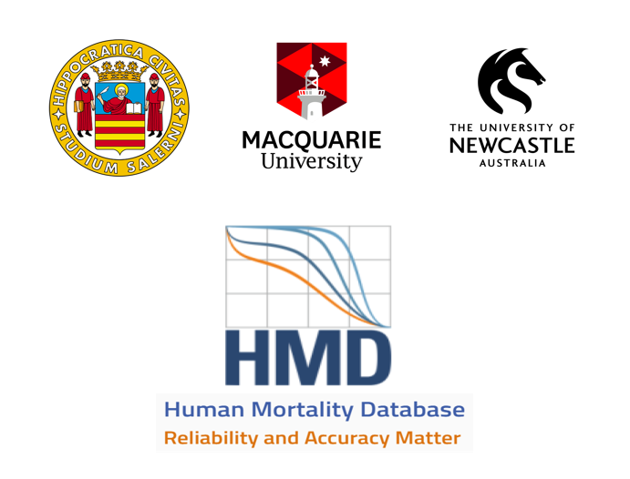
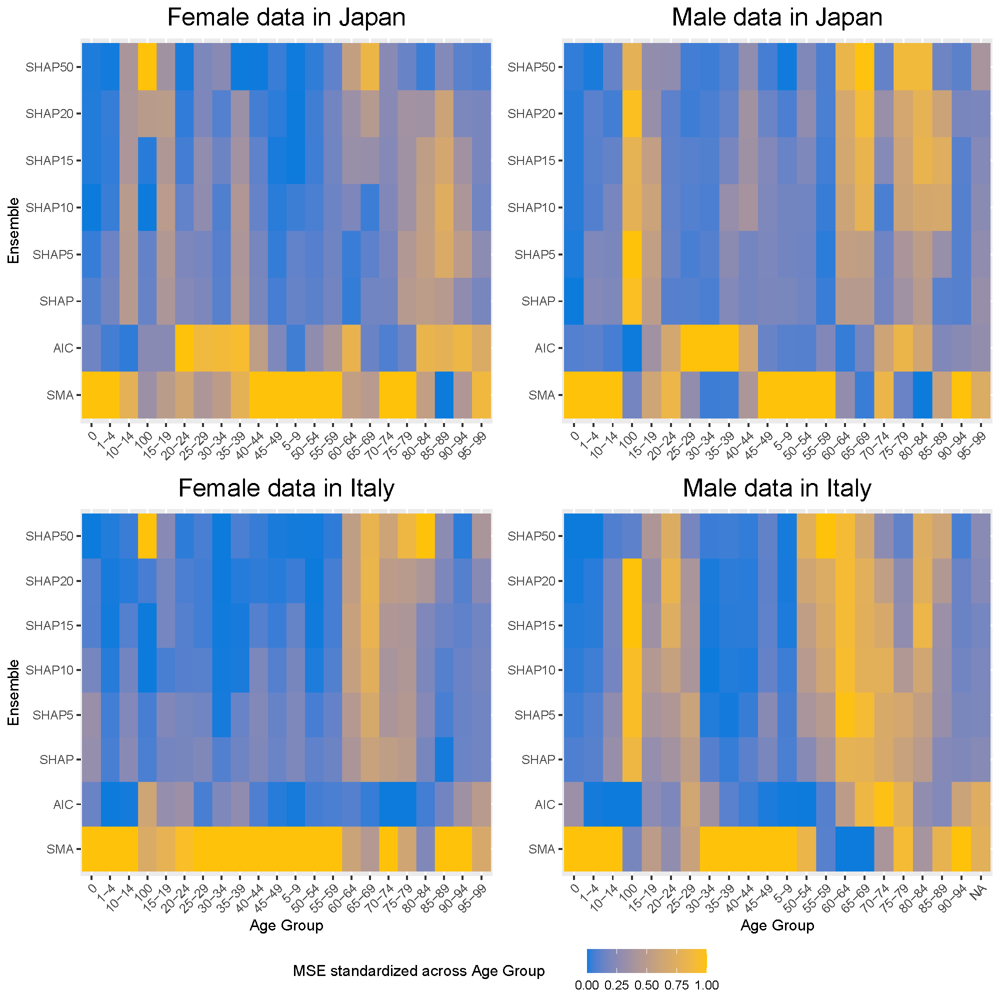

<!-- PROJECT LOGO -->
<br />
<div align="center">
  <a href="https://github.com/YangANU/Ensemble_Mortality_Models">
    
  </a>

<h3 align="center">Enhancing Mortality Forecasting with Ensemble Learning: A Shapley-Based Approach</h3>

</div>

<!-- ABOUT THE PROJECT -->
## Abstract

<p align="justify">
A well-established insight in mortality forecasting is that combining predictions from a set of models improves accuracy compared to relying on a single best model. This paper proposes a novel ensemble approach based on Shapley values, a game-theoretic measure of each model’s marginal contribution to the forecast. We further compute these SHapley Additive exPlanations (SHAP)-based weights age-by-age, thereby capturing the specific contribution of each model at each age. In addition, we introduce a threshold mechanism that excludes models with negligible contributions, effectively reducing the forecast variance. Using data from 24 OECD countries, we demonstrate that our SHAP ensemble enhances out-of-sample forecasting performance, especially at longer horizons. By leveraging the complementary strengths of different mortality models and filtering out those that add little predictive power, our approach offers a robust and interpretable solution for improving mortality forecasts. 
<br />

<div align="center">

</div>
</p>

### Prerequisites
The following R packages are required to replicate the computation results.
```sh
# List of all required packages
required_packages <- c("ggplot2", "tidyverse", "reshape2", "ggpubr", "RColorBrewer", "StMoMo", "h2o", "shapley", "demography", "ftsa", "xlsx", "openxlsx", "forecast")

# Install the packages
install.packages(required_packages)
```
### Main Results
The R script files in the `R Code` folder should be used in the following order:
1. Run the `1_Main_functions.r` to load all customised functions for computation.
2. Either load the provided CSV data files in the `OECD_data` folder, or use the `2_Download_HMD_data.r` script to download the data directly from the Human Mortality Database (HMD). You will need an account registered with HMD to access the data.
3. Use the `3_Point_forecasts_computation.r` to replicate the point forecasts and MSE.
4. Use the `4_Interval_forecasts_computation.r` to replicate the interval forecasts and interval score.
5. The `5_Visualisation_of_results.r` file contains plotting commands to generate the figures in the paper. You need to complete the point and interval computations before creating the visualisations.
6. The `6_Hypothesis_test.r` file conducts the Diebold-Mariano test for evaluating point forecasts.
7. Run the `optional_Data_for_Shiny_App.r` to export the necessary computation results for the Shiny App.

### Shiny App
A Shiny App has been created for visualising additional computation results mentioned in the paper. 
1. Run the `1_Data preparation.R` from the `Shiny App` folder to preprocess the computation results for the Shiny App. Make sure the `Shiny_data_all.RData` and `Shiny_base_fore.RData` are available in the same folder as the Shiny server.
2. Run the `2_server.R` and `3_ui.R` to prepare the App.
3. Execute the `shiny::runApp()` command in the R console to initiate the App.

## Contact
arXiv link: [https://doi.org/10.48550/arXiv.2603.03789](https://arxiv.org/abs/2603.03789)

Giovanna Bimonte - gbimonte@unisa.it

Maria Russolillo - mrussolillo@unisa.it

Han Lin Shang - hanlin.shang@mq.edu.au

Yang Yang - yang.yang10@newcastle.edu.au

<br />
    <a href="[[https://github.com/github_username/repo_name](https://github.com/YangANU/Ensemble_Mortality_Models)](https://github.com/YangANU/Ensemble_Mortality_Models)"><strong>Explore R code »</strong></a>
<br />
